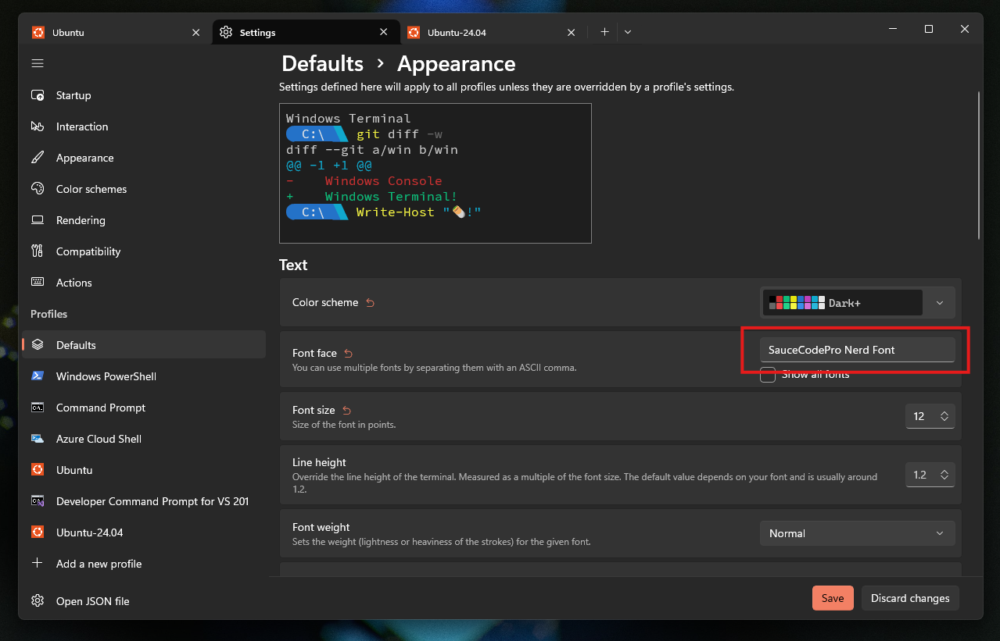

# Prerequisite
### 1. [Download SpaceMono Nerd Font](https://github.com/ryanoasis/nerd-fonts/releases/download/v3.4.0/SpaceMono.zip)
### 2. Install & Set Your Font in Windows Terminal

# Install Script
### 3. Run this in a fresh WSL Ubuntu installation
```sh
git clone https://github.com/AstralJohn/wsl-ubuntu; cd wsl-ubuntu;sudo chmod u+x ./install.sh; ./install.sh
```
